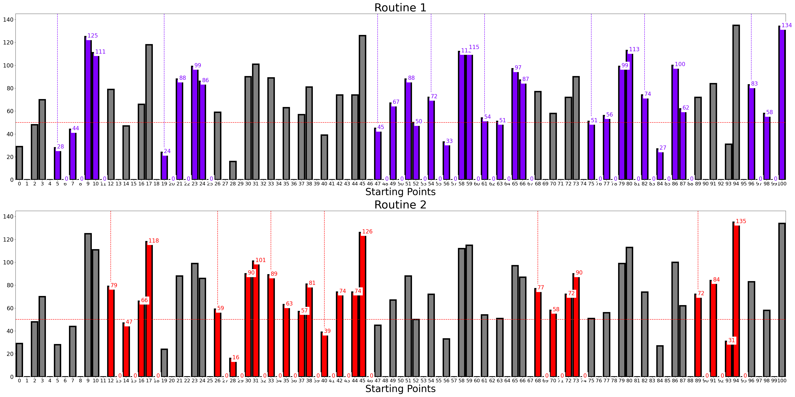
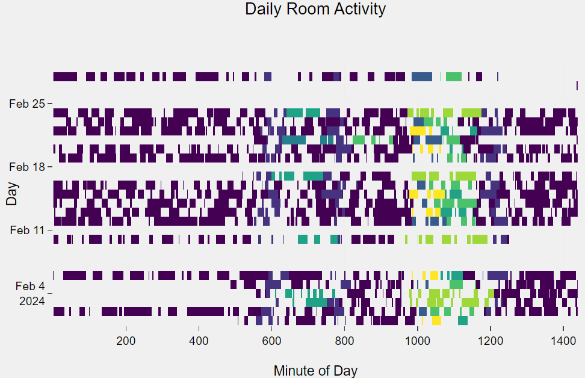

# Brute Force Algorithm in Routine Detection

This project is an implementation of the brute force algorithm in routine detection with our customized synthetic dataset and dictionary. 

## Run main code

```bash
python -m main --data_dir path-to-activities-simulation.csv 
               --dictionary_dir path-to-dictionary_rooms.json
               --param_m int
               --param_R int 
               --param_C int
               --param_G int
               --epsilon float
```


Where:
```markdown
--data_dir: path to the synthetic activity dataset 
--dictionary_dir: path to the dictionary_rooms.json with the correspondencies
--param_m: length of each subsequence
--param_R: least maximum distance 
--param_C: minimum number of matches required
--param_G: least magnitude required
--epsilon: minimum overlap percentage
```

You can modify in main.py the method plot_results to visualize the results of the algorithm. 

```python
    routine_detector.plot_results(title_fontsize=40, labels_fontsize=35,
                                  xlim=(0, 100), xticks_fontsize=18,
                                  yticks_fontsize=20, figsize=(40, 20),
                                  linewidth_bars=5, save_dir="figs/routines_detected.png")
```



The synthetic activity dataset and the JSON with the correspondencies can be obtained on this website implemented by us [Synthetic Activity Dataset](https://javiergavina.github.io/Synthetic-Activity-Dataset/index.html)



Run tests

```bash
    python test/test.py
```

